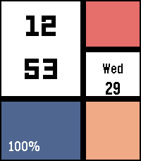
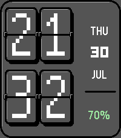
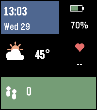
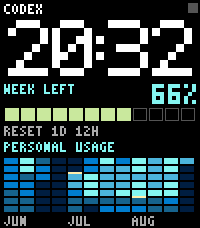
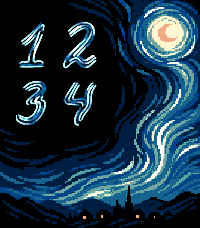
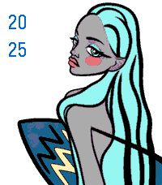
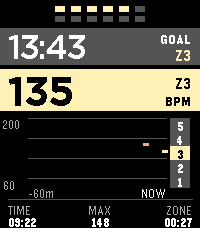
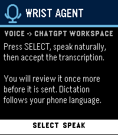
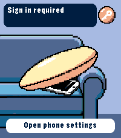
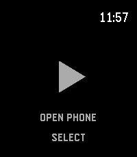

# Pebble Time 2 Pixel Faces

[English](README.md) · **Русский**

Коллекция нативных проектов для Pebble Time 2 на платформе `emery`
(200×228, 64 цвета): восемь циферблатов и четыре приложения. У каждого проекта
свой UUID, версия, каталог исходников и независимо собираемый пакет `.pbw`.

<!-- projects:catalog:start -->
## Галерея проектов

### Циферблаты

| [Mosaic Grid](mosaic-grid/) | [Flip Board](flip-board/) | [Info Tiles](info-tiles/) | [Codex Weekly](codex-weekly/) |
| --- | --- | --- | --- |
| [](mosaic-grid/) | [](flip-board/) | [](info-tiles/) | [](codex-weekly/) |
| [Установить из RePebble](https://apps.repebble.com/mosaic-grid_d2ccde5d2187490085b44f8e) | [Установить из RePebble](https://apps.repebble.com/flip-board_d9b87c9f10a74d718db82b06) | Релиз-кандидат · Не опубликован | [Установить из RePebble](https://apps.repebble.com/codex-weekly_27f48d86803e471a83b93dfe) |

| [Starry Digits](starry-digits/) | [meded90](meded90/) | [Zodiac: Aquarius](zodiac-aquarius/) | [Zodiac: Gemini](zodiac-gemini/) |
| --- | --- | --- | --- |
| [](starry-digits/) | [](meded90/) | [](zodiac-aquarius/) | [](zodiac-gemini/) |
| [Установить из RePebble](https://apps.repebble.com/starry-digits_bacf5a80f08845558f44cf65) | Релиз-кандидат · Не опубликован | Релиз-кандидат · Не опубликован | [Установить из RePebble](https://apps.repebble.com/zodiac-gemini_a1c61f1227144535accbf53c) |

### Приложения

| [Gym Zones](gym-zones/) | [Wrist Agent](wrist-agent/) | [Find My iPhone](find-my-iphone/) | [Voice Drop](voice-drop/) |
| --- | --- | --- | --- |
| [](gym-zones/) | [](wrist-agent/) | [](find-my-iphone/) | [](voice-drop/) |
| Релиз-кандидат · Не опубликован | Релиз-кандидат · Не опубликован | Релиз-кандидат · Не опубликован | Эксперимент · Не опубликован |

«Не опубликован» означает, что в репозитории есть исходники или релиз-кандидат, но нет проверенной публичной страницы в Appstore. Это не означает, что проект прошёл финальную проверку на физических часах или с реальным внешним сервисом.

## Назначение проектов

| Проект | Тип | Версия исходников | Назначение |
| --- | --- | --- | --- |
| [Mosaic Grid](mosaic-grid/) | Циферблат | 1.0.2 | Крупное время в строгой цветной сетке. |
| [Flip Board](flip-board/) | Циферблат | 1.2.1 | Настраиваемые механические flip-панели. |
| [Info Tiles](info-tiles/) | Циферблат | 1.0.0 | Время, погода, заряд, шаги и пульс. |
| [Codex Weekly](codex-weekly/) | Циферблат | 1.0.11 | Лимит Codex и heatmap личного использования. |
| [Starry Digits](starry-digits/) | Циферблат | 1.1.0 | Рисованные цифры на ночном небе; поддерживается и Round 2. |
| [meded90](meded90/) | Циферблат | 1.0.0 | Пиксельный портрет и вертикальное время. |
| [Zodiac: Aquarius](zodiac-aquarius/) | Циферблат | 1.3.0 | Иллюстрация Водолея и вертикальное время. |
| [Zodiac: Gemini](zodiac-gemini/) | Циферблат | 1.4.0 | Иллюстрация Близнецов и крупное цифровое время. |
| [Gym Zones](gym-zones/) | Приложение | 1.0.0 | Силовая тренировка, отдых, пульсовые зоны и минутный PPG-HRV. |
| [Wrist Agent](wrist-agent/) | Приложение | 1.0.0 | Голосовой frontend для самостоятельно развёрнутого ChatGPT Workspace Agent bridge. |
| [Find My iPhone](find-my-iphone/) | Приложение | 0.1.1 | Экспериментальный прямой запрос Apple Find My через подключённый iPhone. |
| [Voice Drop](voice-drop/) | Приложение | 0.2.0 | Запись с микрофона часов через пропатченную прошивку и мобильный мост. |
<!-- projects:catalog:end -->

## Быстрый старт

Установите Pebble CLI и SDK:

```bash
brew install node libpng uv
uv tool install pebble-tool
pebble sdk install latest
```

Соберите восемь циферблатов:

```bash
make build
```

Соберите одно из стандартных приложений:

```bash
make gym-zones PEBBLE="$PWD/.venv/bin/pebble"
make wrist-agent PEBBLE="$PWD/.venv/bin/pebble"
make find-my-iphone PEBBLE="$PWD/.venv/bin/pebble"
```

`make standard-apps` собирает эти три приложения. `make apps` дополнительно
пытается собрать Voice Drop, которому нужен пропатченный PebbleOS SDK из
инструкции [`voice-drop/README.md`](voice-drop/README.md).

Проверенные релизные копии хранятся в [`dist/`](dist/). Наличие пакета там само
по себе не означает публичную публикацию. Старый прототип
`dist/experimental/voice-drop-prototype-0.1.0.pbw` несовместим с текущими
исходниками Voice Drop 0.2.0, и его не следует устанавливать как эту версию.

## Показ и тестирование приложения

Основной путь —
[браузерный pebble-qemu-wasm](https://ericmigi.github.io/pebble-qemu-wasm/).
Соберите или выберите нужный PBW, загрузите Emery / Pebble Time 2 на странице,
затем нажмите **Upload .pbw** или перетащите бинарник на часы. Если пользователь
просит показать, открыть или запустить приложение для тестирования, по умолчанию
используется этот browser-first сценарий, а интерактивный результат остаётся
доступным пользователю.

Стандартный эмулятор Pebble SDK используется только при конкретном сбое загрузки
браузера, WebAssembly, PBW, установки или запуска приложения, а также когда нужны
SDK-логи либо отсутствующие в браузере возможности оборудования или сервисов:

```bash
pebble install --emulator emery --logs path/to/application.pbw
```

Для текущих исходников выполните в каталоге проекта `pebble build`, затем
`pebble install --emulator emery --logs`. Если эмулятор показывает старое
состояние, перед новой сборкой выполните `pebble kill` и `pebble wipe`.

Полный browser-first процесс, управление, локальный запуск `pebble-qemu-wasm`,
условия fallback и границы проверки на физических часах описаны в
[TESTING.ru.md](TESTING.ru.md).

## Опубликовано в RePebble

<!-- projects:published:start -->
- [Mosaic Grid](https://apps.repebble.com/mosaic-grid_d2ccde5d2187490085b44f8e) — 1.0.2
- [Flip Board](https://apps.repebble.com/flip-board_d9b87c9f10a74d718db82b06) — 1.2.1
- [Codex Weekly](https://apps.repebble.com/codex-weekly_27f48d86803e471a83b93dfe) — 1.0.7
- [Starry Digits](https://apps.repebble.com/starry-digits_bacf5a80f08845558f44cf65) — 1.1.0
- [Zodiac: Gemini](https://apps.repebble.com/zodiac-gemini_a1c61f1227144535accbf53c) — 1.3.1
<!-- projects:published:end -->

Процесс публикации описан в [MARKETPLACE_RU.md](MARKETPLACE_RU.md), черновики
карточек находятся в [STORE_LISTINGS.md](STORE_LISTINGS.md). Публичная ссылка
добавляется только после проверки страницы приложения в Appstore.

## Правила репозитория

- [`README.md`](README.md) — основной обзор на английском;
  [`README.ru.md`](README.ru.md) — дополнительная русская версия.
- Каждый Pebble-проект изолирован в своём каталоге и сохраняет стабильный UUID.
- Каждый проект ведёт накопительный `CHANGELOG.md`. Версия исходников не пройдёт
  `npm run projects:check` без непустой записи с тем же номером.
- Сгенерированные `build/` и зависимости игнорируются; выбранные релизные пакеты
  и визуальные материалы версионируются осознанно.
- Требования, границы приватности и результаты проверки находятся рядом с
  исходниками соответствующего проекта.
- Voice Drop, Wrist Agent, Codex Weekly и Find My iPhone зависят от внешних или
  экспериментальных компонентов — перед установкой прочитайте их документацию.
- Перед добавлением проекта или релизного артефакта прочитайте
  [CONTRIBUTING.ru.md](CONTRIBUTING.ru.md).

## Лицензия

См. [LICENSE](LICENSE).
