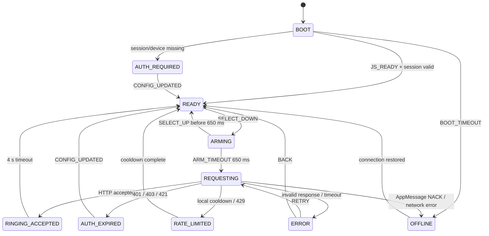

# State machine: Find My iPhone

Машина разделена на две части: C-приложение на часах управляет кнопками и экраном, PebbleKit JS хранит сессию и выполняет HTTPS-запрос. Единственный источник истины для отображаемого состояния — поле `STATE` в AppMessage.

## Состояния часов

| State | Вход | UI | Допустимые события |
|---|---|---|---|
| `BOOT` | запуск приложения | фон, `Подключение…` | `JS_READY`, `BOOT_TIMEOUT` |
| `AUTH_REQUIRED` | нет валидной Apple-сессии/устройства | `badge-auth`, `Откройте настройки` | `CONFIG_UPDATED`, `BACK` |
| `READY` | JS готов, устройство выбрано | hidden phone + low cushion, имя iPhone, `Удерживайте Select` | `SELECT_DOWN`, `DEVICE_NEXT`, `DEVICE_PREV`, `CONNECTION_LOST` |
| `ARMING` | Select нажат | idle phone + high cushion, заполняющийся progress bar | `ARM_TIMEOUT`, `SELECT_UP`, `CONNECTION_LOST` |
| `REQUESTING` | удержание завершено | ring-1/high cushion, `Отправляю…` | `REQUEST_ACCEPTED`, `REQUEST_FAILED`, `REQUEST_TIMEOUT` |
| `RINGING_ACCEPTED` | Apple приняла `playSound` | ring-1/ring-2 + success badge, `iPhone должен звонить` | `SUCCESS_TIMEOUT`, `SELECT_DOWN` |
| `OFFLINE` | AppMessage NACK, нет Bluetooth или сети | hidden phone + offline badge | `RETRY`, `CONNECTION_RESTORED`, `BACK` |
| `AUTH_EXPIRED` | HTTP 401/403/421 или invalid session | hidden phone + auth badge | `CONFIG_UPDATED`, `BACK` |
| `RATE_LIMITED` | повтор слишком рано/HTTP 429 | hidden phone + error badge, обратный отсчёт | `COOLDOWN_DONE`, `BACK` |
| `ERROR` | любой неожиданный ответ | hidden phone + error badge, короткий код | `RETRY`, `BACK` |

`RINGING_ACCEPTED` не является акустическим подтверждением: API сообщает о принятии команды, но не возвращает сигнал с динамика iPhone.

## Диаграмма

## Таймеры и защита от случайного запуска

- Удержание Select: 650 мс. Отпускание раньше возвращает `READY` без запроса.
- Тайм-аут AppMessage ACK: 3 секунды.
- Тайм-аут HTTPS: 20 секунд.
- Экран успеха: 4 секунды, затем автоматический возврат в `READY`.
- Локальный cooldown: 10 секунд между запросами для одного устройства.
- `REQUEST_ID` — случайный/монотонный идентификатор. Повторный ответ с уже завершённым ID игнорируется.
- Пока состояние `REQUESTING`, новое удержание Select не создаёт второй запрос.

## Кнопки

- **Select (hold)** — отправить `playSound` выбранному iPhone.
- **Up / Down** — переключить устройство, если Apple вернула больше одного подходящего iPhone.
- **Back** — закрыть приложение; в `ERROR` сначала возвращает `READY`.

## AppMessage: часы → PebbleKit JS

| Ключ | Тип | Значение |
|---|---|---|
| `COMMAND` | uint8 | `1 = PLAY_SOUND`, `2 = REFRESH_STATUS`, `3 = SELECT_DEVICE` |
| `REQUEST_ID` | uint32 | ID операции для дедупликации |
| `SELECTED_DEVICE` | cstring | устойчивый идентификатор устройства, не отображаемое имя |
| `LOCALE` | cstring | системная локаль Pebble OS, например `ru_RU` |

## AppMessage: PebbleKit JS → часы

| Ключ | Тип | Значение |
|---|---|---|
| `STATE` | uint8 | код одного из состояний выше |
| `RESULT` | uint8 | `0 = none`, `1 = accepted`, `2 = rejected` |
| `ERROR_CODE` | uint16 | стабильный внутренний код, не сырой текст сервера |
| `DEVICE_COUNT` | uint8 | число доступных iPhone |
| `DEVICE_NAME` | cstring | безопасное короткое имя для интерфейса |
| `DEVICE_INDEX` | uint8 | индекс выбранного iPhone в текущем списке |
| `SELECTED_DEVICE` | cstring | ID выбранного устройства |
| `REQUEST_ID` | uint32 | ID операции, к которой относится ответ |

При переключении Up/Down часы отправляют `COMMAND = SELECT_DEVICE` и `DEVICE_INDEX`. PebbleKit JS проверяет границы индекса, сохраняет соответствующий device ID и возвращает часы в `READY`.

## Состояния PebbleKit JS

1. `PKJS_BOOT` — прочитать локальную конфигурацию и проверить наличие сессии.
2. `SESSION_UNKNOWN` — сессия есть, но ещё не проверена текущим запросом.
3. `SESSION_READY` — Apple вернула список устройств; выбранный iPhone существует.
4. `PLAY_SOUND_PENDING` — выполняется ровно один HTTPS-запрос.
5. `REAUTH_REQUIRED` — сессия отклонена; секреты удаляются или помечаются невалидными.

PebbleKit JS не должен передавать Apple ID, пароль, cookies или токены на часы. На часы отправляются только имя/ID устройства, UI-состояние и безопасный код ошибки.
