# Gym Zones

[Русский](README.md) · [English](README.en.md)

`Gym Zones` is an offline strength-training app for Pebble Time 2. It shows
current heart rate and zone, keeps a rolling 60-minute graph, tracks workout and
between-set rest time, and performs a one-minute resting PPG-RMSSD measurement.

This is a watchapp, not a watchface. Opening it never starts a workout: press
Select. Gym Zones has no account, GPS, network service, or server and does not
transmit workout or sensor data. Settings are kept locally on the watch and by
the phone-side Clay configuration UI. Any Pebble Health synchronization is an
operating-system feature outside Gym Zones.

## Requirements and Quick Launch

- Pebble Time 2 (`emery`, 200×228);
- PebbleOS 4.32 or newer;
- Pebble SDK 4.33.1 to build;
- Pebble Health enabled for HR and HRV.

Assign it manually with `Settings → Quick Launch → Tap Up → Gym Zones`. Use
`Hold Up` or the launcher on firmware without `Tap Up`. The Up press that
launches the app is not reused; press Up again inside Gym Zones to open HRV.

## Controls and behavior

| State | Up | Select | Down | Back |
| --- | --- | --- | --- | --- |
| Summary / idle | HRV | Start | Hint | Exit |
| Workout | HRV | Confirm finish | Rest | Exit |
| Rest | HRV | Confirm finish | `+30 sec` | Next set |
| HRV, idle | Return | Measure | — | Return |
| HRV, workout | Return | Confirm finish | Rest / `+30` | Return |

`TIME` runs continuously through rest. An exited session has a ten-minute resume
window; otherwise the next launch materializes an `AUTO FINISH` summary at that
deadline.

Down starts the configured rest preset (`1:30`, `2:00`, `3:00`, or `5:00`) and
adds 30 seconds while resting. At zero the watch vibrates once and counts
overtime. WakeupService reopens Gym Zones at the deadline after exit.

Phone settings support manual maximum HR, an age formula, or five strictly
increasing lower limits. Optional target-zone entry/exit vibration is suppressed
during rest. Invalid updates never replace the last good settings.
Heart rate below Z1 is labelled with the neutral `REC`; it is not a medical
interpretation.

Outside a workout, open HRV and press Select. Keep still while 60 seconds of
usable PPI are collected. The first valid result of each local day can enter a
seven-day baseline; `BASE` appears after three days. During a workout a new
measurement is blocked.

This is a `PPG ESTIMATE`, not clinical ECG-HRV, a diagnosis, or a readiness
score. Raw PPI stays in RAM.

## Build and test

```bash
cd gym-zones
../.venv/bin/pebble sdk activate 4.33.1
npm install
../.venv/bin/pebble build
make -C tests test
```

The emulator does not validate physical HRV. Test PPI, Wakeup behavior, and
sample-period cleanup on a real Pebble Time 2. A local build writes
`build/gym-zones.pbw`; the verified release copy is `../dist/gym-zones.pbw`.
See [VALIDATION.md](VALIDATION.md) for the exact emulator and hardware matrix.

## Emulator screenshots

| First launch | Active Z3 | Active Z5 |
| --- | --- | --- |
| 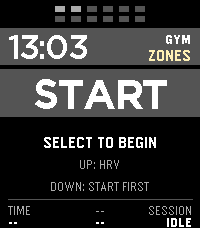 |  | 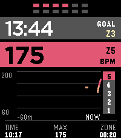 |

| Rest | Finish confirmation | Last summary |
| --- | --- | --- |
| 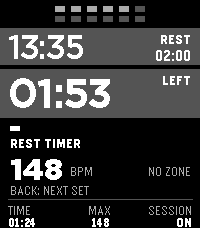 | 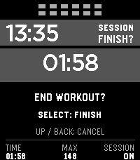 | 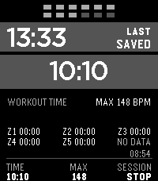 |

| Below Z1 | Resume before deadline | Auto finish |
| --- | --- | --- |
| 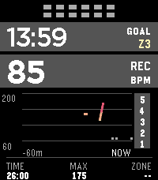 | 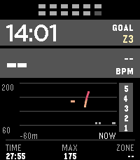 | 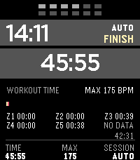 |

| Rest overtime | Wakeup foreground | HRV unsupported |
| --- | --- | --- |
| 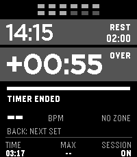 | 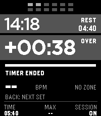 | 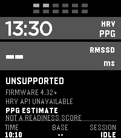 |

## Rationale and APIs

Rest duration remains the primary cue; Gym Zones does not infer readiness from
heart rate. Longer presets are available for heavy sets. See the
[systematic review](https://pubmed.ncbi.nlm.nih.gov/28933024/) and the
[rest/hypertrophy meta-analysis](https://www.frontiersin.org/journals/sports-and-active-living/articles/10.3389/fspor.2024.1429789/full).
The HRV result is a short resting PPG wellness estimate; see the
[post-resistance PPG study](https://pmc.ncbi.nlm.nih.gov/articles/PMC7600564/)
and an [HRV-guided protocol example](https://pmc.ncbi.nlm.nih.gov/articles/PMC8705715/).
Pebble integrations use the official
[HR/HRV](https://developer.repebble.com/guides/events-and-services/hrm/),
[WakeupService](https://developer.repebble.com/guides/events-and-services/wakeups/),
and [Launch Reason](https://developer.repebble.com/docs/c/Foundation/Launch_Reason/)
APIs.
